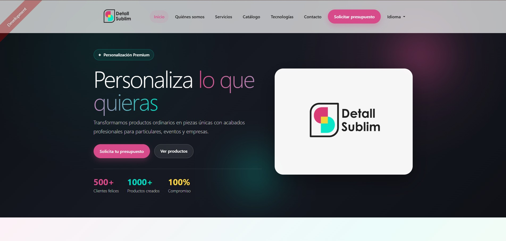
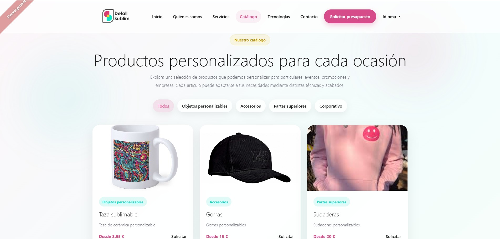
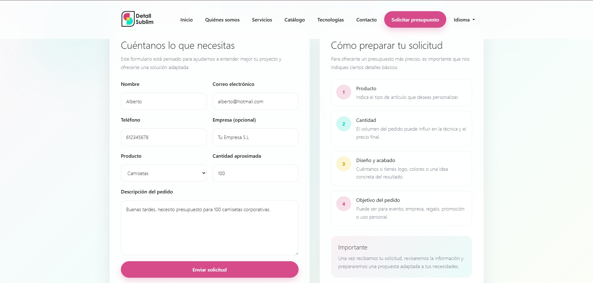
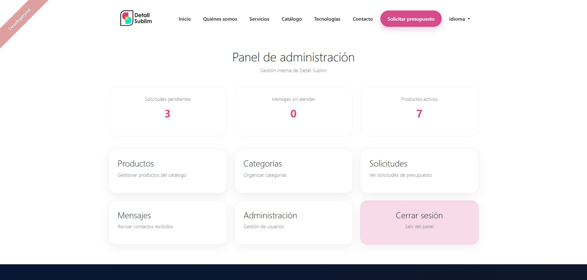
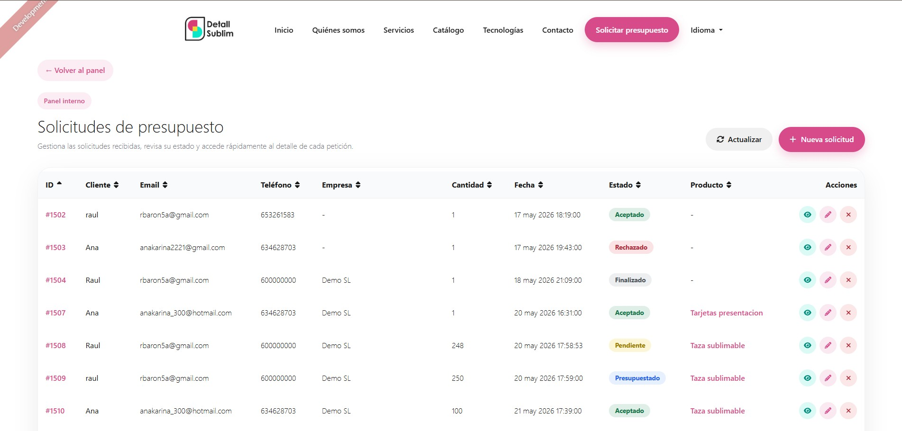
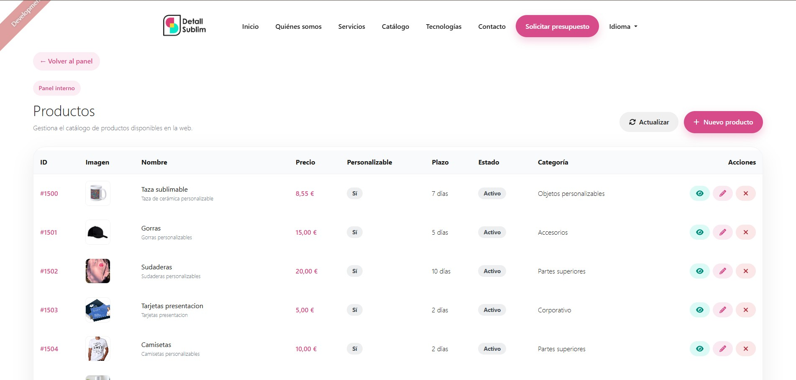

# Detall Sublim

Aplicación web Full Stack para una empresa de productos personalizados, desarrollada con **Angular, TypeScript, Java, Spring Boot y MySQL**.

El proyecto combina una web corporativa pública con un sistema de solicitud de presupuestos y un panel privado de administración para gestionar productos, categorías, solicitudes, mensajes y usuarios.

> Proyecto desarrollado como parte de mi formación en Desarrollo de Aplicaciones Web (DAW).

---

## Vista general



Detall Sublim nace como una solución para digitalizar la presentación del catálogo de una empresa de personalización y centralizar la gestión de solicitudes de presupuesto.

La aplicación está dividida en dos áreas principales:

- **Área pública**, orientada a clientes.
- **Panel de administración**, orientado a la gestión interna del negocio.

---

## Funcionalidades principales

### Área pública

- Página corporativa responsive.
- Catálogo de productos.
- Filtrado por categorías.
- Visualización de precios orientativos.
- Solicitud personalizada de presupuestos.
- Formulario de contacto.
- Navegación entre las distintas áreas de servicios y tecnologías.

### Panel de administración

- Autenticación de usuarios.
- Gestión de productos.
- Gestión de categorías.
- Gestión de solicitudes de presupuesto.
- Gestión de mensajes de contacto.
- Gestión de usuarios y roles.
- Actualización del estado de las solicitudes.
- Registro de precio y tiempo estimado de un presupuesto.
- Envío de notificaciones por correo electrónico asociado al estado de las solicitudes.

---

## Catálogo de productos

El catálogo permite consultar los productos disponibles y filtrarlos por categoría.



---

## Solicitud de presupuesto

Los clientes pueden seleccionar un producto y enviar una solicitud indicando cantidad, empresa y detalles adicionales.



Las solicitudes quedan registradas en el backend y pueden gestionarse posteriormente desde el panel privado.

---

## Panel de administración

El panel de administración permite gestionar las principales áreas de la aplicación desde una interfaz privada.



Desde este panel se puede acceder a la gestión de productos, categorías, solicitudes de presupuesto, mensajes de contacto y usuarios.

### Gestión de solicitudes

Las solicitudes de presupuesto pueden consultarse y administrarse desde el panel interno.

Cada solicitud puede pasar por distintos estados:

- Pendiente
- Presupuestado
- Aceptado
- Rechazado
- Finalizado



Desde esta sección se puede revisar la información enviada por el cliente, actualizar el estado de la solicitud y registrar datos asociados al presupuesto.

### Gestión de productos

El panel permite administrar el catálogo de productos disponibles en la aplicación.

Desde esta sección es posible gestionar información como:

- Nombre del producto.
- Descripción.
- Precio orientativo.
- Categoría.
- Imagen.
- Estado del producto.



---

## Stack tecnológico

### Frontend

- Angular
- TypeScript
- HTML5
- SCSS
- Bootstrap / ng-bootstrap

### Backend

- Java
- Spring Boot
- Spring Security
- APIs REST
- JWT

### Persistencia

- MySQL
- Spring Data JPA
- Hibernate

### Herramientas

- JHipster 8.11.0
- Maven
- npm
- Git
- GitHub
- Figma

---

## Arquitectura

La aplicación sigue una arquitectura Full Stack separada por responsabilidades:

```text
Angular
   │
   │ HTTP / REST
   ▼
Spring Boot
   │
   ├── REST Controllers
   ├── Services
   ├── Security / JWT
   ├── Repositories
   │
   ▼
 MySQL
```

El frontend consume los endpoints REST expuestos por Spring Boot, mientras que el backend se encarga de la lógica de negocio, la seguridad y la persistencia de datos.

---

## Seguridad

La aplicación utiliza **Spring Security** y autenticación mediante **JWT**.

Las operaciones administrativas están protegidas, mientras que determinados endpoints necesarios para la parte pública permiten:

- consultar productos;
- consultar categorías;
- enviar mensajes de contacto;
- enviar solicitudes de presupuesto.

Las claves y credenciales sensibles no están almacenadas directamente en el repositorio y se proporcionan mediante variables de entorno.

---

## Ejecución en local

### Requisitos

- Java
- Node.js / npm
- MySQL
- Maven Wrapper incluido en el proyecto

### Backend

```bash
./mvnw
```

### Frontend

En otra terminal:

```bash
./npmw start
```

Durante el desarrollo, la aplicación frontend estará disponible en:

- http://localhost:4200

Y el backend en:

- http://localhost:8080

---

## Variables de entorno

Para evitar almacenar información sensible en el código fuente, determinadas configuraciones se proporcionan mediante variables de entorno.

Entre ellas:

```text
JHIPSTER_SECURITY_AUTHENTICATION_JWT_BASE64_SECRET
MAIL_USERNAME
MAIL_PASSWORD
```

---

## Estado del proyecto

**Desarrollo funcional completado.**

Actualmente el proyecto se encuentra en fase de preparación final, incluyendo:

- personalización definitiva de contenidos;
- mejora y ampliación de pruebas automatizadas;
- preparación del despliegue;
- posibles mejoras de UX y rendimiento.

---

## Próximas mejoras

- Despliegue de la aplicación.
- Generación de presupuestos en PDF.
- Mejora de la cobertura de pruebas.
- Automatización CI/CD.
- Optimización adicional de la experiencia responsive.
- Mejoras en el sistema de notificaciones por correo.

---

## Sobre el proyecto

Detall Sublim ha sido desarrollado de forma individual como proyecto Full Stack, trabajando tanto en la interfaz de usuario como en el backend, el modelo de datos, la API REST, la seguridad y la lógica de negocio.

El proyecto fue generado inicialmente con **JHipster 8.11.0** y posteriormente personalizado y ampliado para implementar los requisitos específicos de la aplicación.

---

## Autor

**Raúl Barón Gómez**

Desarrollador Full Stack Junior especializado en:

- Angular
- TypeScript
- Java
- Spring Boot

[LinkedIn](https://www.linkedin.com/in/raulbarongomez/) · [GitHub](https://github.com/RaulBaron373)
